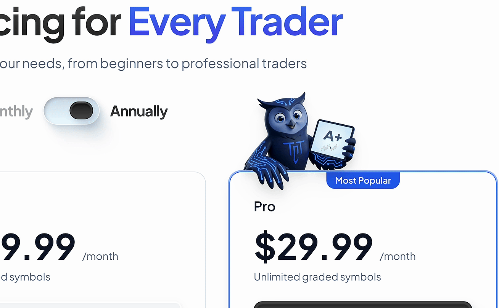
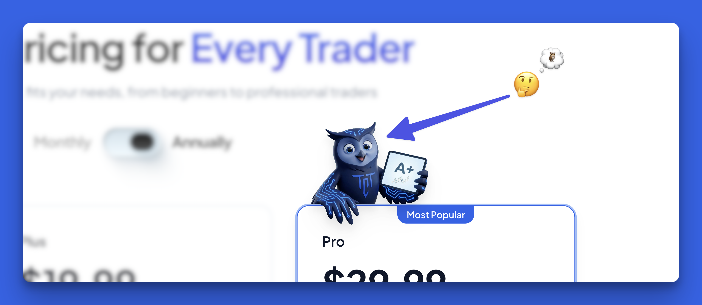

# chromakey-video-react

[](https://www.npmjs.com/package/chromakey-video-react)
[](https://github.com/anl331/chromakey-video-react/blob/main/LICENSE)
[](https://bundlephobia.com/package/chromakey-video-react)

> **Real-time chroma key video in React. No FFmpeg, no pre-processing, runs on the GPU.**

Drop a green-screen video into your React app and get instant transparency, rendered frame-by-frame on the GPU with a single WebGL shader. No server, no WASM, no waiting.

<p align="center">
  
</p>

## Install

```bash
npm install chromakey-video-react
```

## Quick Start

```tsx
import { ChromaKeyVideo } from 'chromakey-video-react';

function App() {
  return (
    <ChromaKeyVideo
      src="/presenter-greenscreen.mp4"
      className="w-[400px]"
    />
  );
}
```

That's it. The green background is gone.

## The Story Behind This

I needed a 3D animated mascot for [my product's website](https://usetct.io). No budget for a designer, no patience for Blender. So I generated the character with AI (Higgsfield.ai), animated it with Kling 2.5, and rendered it on a solid green background.

<p align="center">
  
</p>

Then I needed to remove the green. The obvious route: FFmpeg chroma key filter, export WebM with alpha, done. Tried it. The results were rough. Green bleeding around edges, and WebM with alpha doesn't work on Safari. File sizes balloon when you add a transparency channel.

So I wrote a WebGL shader that does it in real-time, in the browser, on the GPU. Turned out to be cleaner, faster, and more flexible than any pre-processing approach. Packaged it into this component.

<p align="center">
  
</p>

## Why Not FFmpeg / WebM with Alpha?

| | This package | FFmpeg pre-processing | WebM alpha |
|---|---|---|---|
| **Setup** | `npm install`, done | Need FFmpeg pipeline, server or build step | Need to re-encode video |
| **File size** | Regular MP4 | Same or larger | 2-5x larger (alpha channel) |
| **Browser support** | All (WebGL) | N/A | Chrome/Firefox only (no Safari) |
| **Runtime cost** | GPU shader, ~0ms CPU | None (pre-processed) | Decode cost for larger file |
| **Flexibility** | Adjust threshold live | Re-encode to change | Re-encode to change |
| **Any key color** | Change via prop | Different preset per color | Baked in |

The sweet spot: keep your regular MP4 files (small, compatible everywhere), and the GPU does the keying at 60fps.

## Props

| Prop | Type | Default | Description |
|------|------|---------|-------------|
| `src` | `string` | *required* | Video source URL |
| `color` | `string` | `"#00ff00"` | Hex color to key out (e.g. `"#00ff00"` for green, `"#0000ff"` for blue) |
| `similarity` | `number` | `0.35` | How aggressively to match the key color (0-1). Higher = more removal. |
| `blend` | `number` | `0.15` | Soft edge blending range (0-1). Higher = softer edges. |
| `despill` | `boolean` | `true` | Remove color spill/tint from edges of the subject |
| `loop` | `boolean` | `true` | Loop the video |
| `autoPlay` | `boolean` | `true` | Auto-play the video (always muted for browser autoplay policy) |
| `className` | `string` | — | CSS class applied to the `<canvas>` element |

## Advanced Usage

### Blue Screen

```tsx
<ChromaKeyVideo src="/blue-screen.mp4" color="#0000ff" />
```

### Fine-tuning

```tsx
<ChromaKeyVideo
  src="/tricky-footage.mp4"
  similarity={0.4}  // more aggressive removal
  blend={0.2}       // softer edges
  despill={true}    // clean up color fringing
/>
```

## Tips

- **Background color matters.** Use a color far from anything in your subject. Green (`#00ff00`) is standard. If your subject has green, use magenta (`#FF00FF`).
- **Keep everything opaque.** Semi-transparent elements in the video (holographic effects, glass, etc.) will cause issues with chroma removal.
- **CORS headers.** If your video is cross-origin, make sure it's served with proper CORS headers or WebGL can't read the frames.

## Browser Support

Works in all browsers that support WebGL (97%+ global coverage).

## Read More

📖 [How I built real-time green screen removal in the browser](https://x.com/_itsanl/status/2022425470474625404)

## Credits

Built by [@_itsanl](https://x.com/_itsanl) (Alfredo Natal) while building [TCT](https://usetct.io), a Chrome extension that helps traders grade their setups before entering.

## License

[MIT](./LICENSE)
